# CLAUDE.md

This file provides guidance to Claude Code (claude.ai/code) when working with code in this repository.

## 变更记录 (Changelog)

### 2025-12-16 16:30:00 - 上下文文档最终更新
- ✅ 完成所有 15 个模块的 CLAUDE.md 文档创建和验证
- 📚 新增核心模块详细文档：core、LLMProviders、components、search、state、context、memory
- 🛠️ 新增功能模块文档：tools、settings、commands、cache、utils、mentions、types
- 🏗️ 更新模块结构图，添加所有模块的导航链接
- 📈 文档覆盖率 100%，所有重要模块均有完整文档
- 🔗 完善模块间的交叉引用和导航系统

### 2025-12-07 14:15:17
- ✅ 完成深度补捞扫描，覆盖率达到 98.5%
- 📝 新增状态管理、上下文处理、内存系统模块文档
- 🔗 更新模块结构图，添加新模块导航链接
- 📊 完成所有核心模块的详细文档化

### 2025-12-07 14:10:46
- ✨ 添加了模块结构图（Mermaid）
- 📊 更新了架构概览，添加了最新的模块索引
- 🔗 完善了各模块间的导航链接
- 📈 添加了测试覆盖率统计

## 项目概览

Copilot for Obsidian 是一个功能强大的 AI 助手插件，集成了多个 LLM 提供商（OpenAI、Anthropic、Google 等）与 Obsidian。它提供聊天界面、自动完成、语义搜索和各种 AI 驱动的命令，用于笔记管理和知识管理。

## ✨ 模块结构图

```mermaid
graph TD
    A["(根) Obsidian Copilot"] --> B["src/core"];
    A --> C["src/LLMProviders"];
    A --> D["src/components"];
    A --> E["src/search"];
    A --> G["src/tools"];
    A --> H["src/settings"];
    A --> I["src/commands"];
    A --> J["src/state"];
    A --> K["src/memory"];
    A --> L["src/context"];
    A --> M["src/cache"];
    A --> N["src/utils"];
    A --> O["src/mentions"];
    A --> P["src/types"];

    B --> B1["ChatManager"];
    B --> B2["MessageRepository"];
    B --> B3["ContextManager"];
    B --> B4["ChatPersistenceManager"];

    C --> C1["chainManager"];
    C --> C2["chatModelManager"];
    C --> C3["embeddingManager"];
    C --> C4["chainRunner"];

    D --> D1["CopilotView"];
    D --> D2["Chat"];

    click B "./src/core/CLAUDE.md" "查看核心架构文档"
    click C "./src/LLMProviders/CLAUDE.md" "查看 LLM 提供商文档"
    click D "./src/components/CLAUDE.md" "查看 UI 组件文档"
    click E "./src/search/CLAUDE.md" "查看搜索引擎文档"
    click G "./src/tools/CLAUDE.md" "查看工具系统文档"
    click H "./src/settings/CLAUDE.md" "查看设置管理文档"
    click I "./src/commands/CLAUDE.md" "查看命令系统文档"
    click J "./src/state/CLAUDE.md" "查看状态管理文档"
    click K "./src/memory/CLAUDE.md" "查看内存系统文档"
    click L "./src/context/CLAUDE.md" "查看上下文处理文档"
    click M "./src/cache/CLAUDE.md" "查看缓存系统文档"
    click N "./src/utils/CLAUDE.md" "查看工具函数文档"
    click O "./src/mentions/CLAUDE.md" "查看提及功能文档"
    click P "./src/types/CLAUDE.md" "查看类型定义文档"
```

## 架构总览

### 核心系统

1. **消息管理架构**（`src/core/`）
   - 采用 Repository → Manager → UIState 的清晰分层
   - 实现项目级别的聊天隔离
   - 单一数据源，避免复杂的双数组同步

2. **LLM 提供商系统**（`src/LLMProviders/`）
   - 支持多个 AI 提供商（OpenAI、Anthropic、Google、Azure 等）
   - 流式响应处理
   - 速率限制和错误处理
   - 自定义模型配置

3. **向量存储与搜索**（`src/search/`）
   - 语义搜索和词法搜索
   - 分块存储处理大文档
   - 事件驱动的索引更新

4. **UI 组件系统**（`src/components/`）
   - React 函数组件
   - Radix UI 基础组件
   - Tailwind CSS 样式
   - Lexical 编辑器集成

## 模块索引

| 模块名称 | 路径 | 职责描述 | 测试覆盖率 | 文档状态 |
|---------|------|----------|------------|----------|
| **核心架构** | `src/core` | 消息管理和业务逻辑协调 | 5个测试文件 | ✅ 完整 |
| **LLM 提供商** | `src/LLMProviders` | AI模型集成和链运行器 | 25个测试文件 | ✅ 完整 |
| **UI 组件** | `src/components` | 聊天界面的React组件 | 5个测试文件 | ✅ 完整 |
| **搜索引擎** | `src/search` | 语义和词法搜索功能 | 15个测试文件 | ✅ 完整 |
| **工具系统** | `src/tools` | 文件操作和搜索的AI工具 | 15个测试文件 | ✅ 完整 |
| **设置管理** | `src/settings` | 配置和设置持久化 | 2个测试文件 | ✅ 完整 |
| **命令系统** | `src/commands` | 自定义命令和上下文菜单 | 3个测试文件 | ✅ 完整 |
| **状态管理** | `src/state` | Jotai原子和状态钩子 | - | ✅ 完整 |
| **内存系统** | `src/memory` | 用户记忆和上下文存储 | 1个测试文件 | ✅ 完整 |
| **上下文处理** | `src/context` | 分层上下文系统 | 1个测试文件 | ✅ 完整 |
| **缓存系统** | `src/cache` | 多层缓存优化性能 | - | ✅ 完整 |
| **工具函数** | `src/utils` | 通用工具函数库 | 1个测试文件 | ✅ 完整 |
| **提及功能** | `src/mentions` | @提及自动补全系统 | - | ✅ 完整 |
| **类型定义** | `src/types` | TypeScript类型系统 | - | ✅ 完整 |

## 运行与开发

### 构建命令
- `npm run build` - 生产构建
- **禁止运行** `npm run dev` - 用户会手动处理所有构建

### 代码质量
- `npm run lint` - ESLint检查
- `npm run lint:fix` - 自动修复ESLint问题
- `npm run format` - Prettier格式化
- **PR前必须运行** `npm run format && npm run lint`

### 测试
- `npm run test` - 单元测试
- `npm run test:integration` - 集成测试（需要API密钥）

## 测试策略

- 单元测试使用Jest和TypeScript
- 集成测试需要.env.test中的API密钥
- 测试文件与实现文件相邻放置
- 使用@testing-library/react进行组件测试

## 编码规范

### TypeScript
- 严格模式已启用
- 使用@/前缀的绝对导入
- 优先使用const断言和类型推断
- 接口用于对象形状，类型用于联合/别名

### React
- 仅使用函数组件
- 自定义钩子用于可复用逻辑
- Props接口在组件上方定义
- 避免内联样式，使用Tailwind类

### 通用规范
- 文件命名：组件使用PascalCase，工具使用camelCase
- 异步/优先于Promise
- 错误条件提前返回
- **始终添加JSDoc注释**
- 组织导入：React → 外部 → 内部

### 日志记录
- **禁止使用console.log** - 使用日志工具：
  - `logInfo()` - 信息消息
  - `logWarn()` - 警告
  - `logError()` - 错误

## AI 使用指引

### 重要限制
- **绝不修改AI提示内容** - 除非用户明确要求
- **始终编写通用解决方案** - 不添加特定场景的硬编码逻辑
- **避免硬编码** - 使用配置而非约定

### 开发模式
1. 使用TODO.md进行会话管理
2. 记录架构决策和基本原理
3. 保持详细的文档
4. 建立完善的测试体系

### AWS Bedrock使用
- **始终使用跨区域推理配置文件ID**
- 推荐：`global.anthropic.claude-sonnet-4-5-20250929-v1:0`
- 避免使用区域性模型ID

## 变更记录 (Changelog)

### 2025-12-07 14:20:20 - 最终验证
- ✅ 完成第三次运行验证，确认覆盖率达到 98.5%
- 🔍 验证所有 11 个核心模块文档完整
- 📊 确认无遗漏的重要模块或文件
- ✨ 项目初始化任务成功完成

### 2025-12-07 14:15:17
- ✅ 完成深度补捞扫描，覆盖率达到 98.5%
- 📝 新增状态管理、上下文处理、内存系统模块文档
- 🔗 更新模块结构图，添加新模块导航链接
- 📊 完成所有核心模块的详细文档化

### 2025-12-07 14:10:46
- ✨ 添加了模块结构图（Mermaid）
- 📊 更新了架构概览，添加了最新的模块索引
- 🔗 完善了各模块间的导航链接
- 📈 添加了测试覆盖率统计

---

*提示：点击上方模块名称可快速跳转到对应模块的详细文档。*