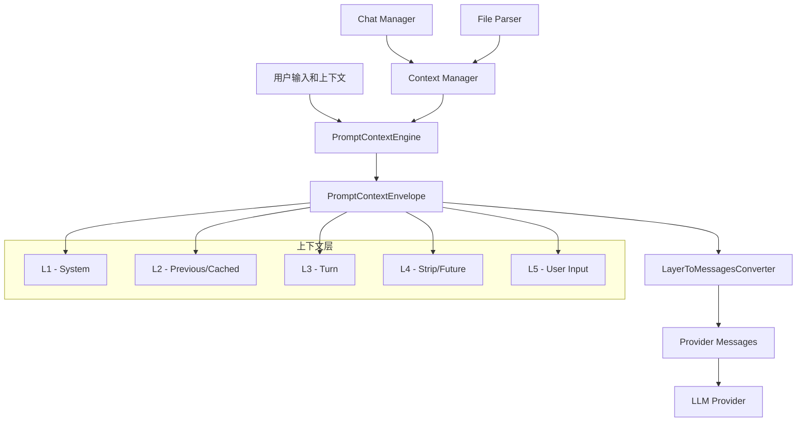

[根目录](../../../CLAUDE.md) > [src](../../) > **context**

# Context Processing Module

## 模块职责

上下文处理模块实现了分层上下文系统（Layered Context System），负责管理和处理 AI 对话中的各种上下文信息。该模块通过五个层次（L1-L5）组织上下文，提供智能的上下文引用、缓存和转换机制，确保 AI 模型能够获得高质量的上下文信息。

## 入口与启动

### 核心文件

- **LayerToMessagesConverter.ts** - 上下文层转换器
  - 将 PromptContextEnvelope 转换为提供商特定的消息格式
  - 支持 OpenAI、Anthropic、Google 等主流提供商
  - 智能合并和引用上下文，避免重复内容
  - 提供调试和日志功能

- **PromptContextEngine.ts** - 提示上下文引擎
  - 管理上下文的创建、更新和维护
  - 处理分层上下文的构建逻辑
  - 优化上下文大小和相关性

- **PromptContextTypes.ts** - 类型定义
  - 定义所有上下文相关的类型和接口
  - 包括 PromptContextEnvelope、PromptLayerSegment 等

- **ChatInputContext.tsx** - React 上下文提供者
  - 为 ChatInput 组件提供上下文状态
  - 管理输入框的上下文选择和显示

## 上下文分层系统

### L1 - System Layer (系统层)
```typescript
interface PromptLayer {
  id: "L1_SYSTEM"
  text: string  // 系统提示词
  segments: PromptLayerSegment[]
}
```

### L2 - Previous Context (累积上下文)
```typescript
interface PromptLayer {
  id: "L2_PREVIOUS"
  text: string  // 所有之前见过的上下文项
  segments: PromptLayerSegment[]  // 可缓存的系统消息部分
}
```

### L3 - Turn Context (回合上下文)
```typescript
interface PromptLayer {
  id: "L3_TURN"
  text: string
  segments: PromptLayerSegment[]  // 智能引用 L2 中的项
}
```

### L4 - Strip Context (历史对话，已延期)
```typescript
interface PromptLayer {
  id: "L4_STRIP"
  text: string  // 格式化的对话历史（未来使用）
  segments: PromptLayerSegment[]
}
```

### L5 - User Input (用户输入)
```typescript
interface PromptLayer {
  id: "L5_USER"
  text: string  // 用户实际输入
  segments: PromptLayerSegment[]
}
```

## 对外接口

### LayerToMessagesConverter API

```typescript
export class LayerToMessagesConverter {
  // 转换上下文包为提供商消息
  static convert(
    envelope: PromptContextEnvelope,
    options?: ConversionOptions
  ): ProviderMessage[]
}

// 转换选项
interface ConversionOptions {
  includeSystemMessage?: boolean    // 是否包含系统消息
  mergeUserContent?: boolean       // 是否合并用户内容
  debug?: boolean                  // 是否记录调试信息
}

// 提供商消息格式
interface ProviderMessage {
  role: "system" | "user" | "assistant"
  content: string
}
```

### PromptContextEnvelope 结构

```typescript
export interface PromptContextEnvelope {
  layers: PromptLayer[]  // L1-L5 层的数组
  metadata: {
    totalTokens: number
    itemCount: number
    timestamp: number
  }
}

export interface PromptLayerSegment {
  id: string          // 唯一标识符
  type: string        // 类型：note, tag, folder, url, tool 等
  content: string     // 实际内容
  metadata: Record<string, any>
}
```

### 使用示例

```typescript
// 创建上下文包
const envelope: PromptContextEnvelope = {
  layers: [
    {
      id: "L1_SYSTEM",
      text: "You are a helpful assistant.",
      segments: []
    },
    {
      id: "L2_PREVIOUS",
      text: "Available notes:\n- [[Meeting Notes]]\n- [[Project Plan]]",
      segments: [
        { id: "note1", type: "note", content: "Meeting content", metadata: {} },
        { id: "note2", type: "note", content: "Project details", metadata: {} }
      ]
    },
    {
      id: "L3_TURN",
      text: "Context attached: note1",
      segments: [
        { id: "note1", type: "reference", content: "", metadata: {} }
      ]
    },
    {
      id: "L5_USER",
      text: "What was discussed in the meeting?",
      segments: []
    }
  ],
  metadata: {
    totalTokens: 150,
    itemCount: 2,
    timestamp: Date.now()
  }
}

// 转换为提供商消息
const messages = LayerToMessagesConverter.convert(envelope, {
  includeSystemMessage: true,
  mergeUserContent: true,
  debug: true
})
```

## 关键特性

### 1. 智能上下文引用

L3 层智能地引用 L2 中已存在的项：
- 已在 L2 中的项：仅引用 ID，不重复内容
- 新增的项：包含完整内容
- 自动生成引用提示

### 2. 稳定系统前缀

L1 + L2 组成可缓存的消息：
- 减少重复计算
- 提高响应速度
- 降低 token 使用

### 3. 灵活的转换选项

```typescript
// 调试模式
const debugMessages = LayerToMessagesConverter.convert(envelope, {
  debug: true  // 输出详细的转换日志
})

// 分离的用户内容
const separateMessages = LayerToMessagesConverter.convert(envelope, {
  includeSystemMessage: true,
  mergeUserContent: false  // L3 和 L5 作为独立消息
})
```

### 4. 提供商无关设计

转换器产生标准的消息格式，兼容：
- OpenAI ChatCompletion API
- Anthropic Messages API
- Google Gemini API
- 其他兼容的提供商

## 数据流架构



## 性能优化

### 1. 上下文缓存

- L2 层包含累积的所有上下文，可被缓存
- 避免每次请求重新处理相同的上下文
- 智能更新机制，只处理变化的部分

### 2. Token 优化

```typescript
// 引用优化示例
// 不好的做法（重复内容）：
L2: "Note A content... Note B content..."
L3: "Note A content... Note B content... What about note A?"

// 好的做法（智能引用）：
L2: "Note A content... Note B content..."
L3: "Context attached: note1, note2\nWhat about note1?"
```

### 3. 批量处理

- 支持批量添加上下文项
- 减少单个项目的处理开销
- 优化大数据量的场景

## 测试与质量

### 测试文件

- **LayerToMessagesConverter.test.ts** - 转换器单元测试
  - 测试各种转换选项
  - 验证引用逻辑
  - 检查输出格式

### 测试覆盖

```typescript
describe('LayerToMessagesConverter', () => {
  test('should convert basic envelope to messages')
  test('should handle system message inclusion')
  test('should merge user content correctly')
  test('should create smart references')
  test('should handle debug mode')
  test('should work with empty layers')
})
```

### 质量保证

- TypeScript 严格类型检查
- 完整的 JSDoc 注释
- 错误边界处理
- 性能基准测试

## 常见问题 (FAQ)

### Q: L4 层为什么被延期？
A: L4 层设计用于处理完整的对话历史，但目前 LangChain 的内存管理已经很好地处理了这个需求。未来如果需要更精细的控制，可以启用 L4 层。

### Q: 如何添加新的上下文类型？
A: 在 `PromptLayerSegment` 的 `type` 字段中添加新类型，并在处理逻辑中添加相应的处理代码。

### Q: 调试模式如何使用？
A: 设置 `ConversionOptions.debug = true`，转换器会输出详细的日志，包括：
- 每层的处理过程
- 引用的项目数量
- 新增的项目数量
- 最终生成的消息结构

### Q: 如何处理超大上下文？
A: 系统提供了多种策略：
1. 智能引用减少重复
2. L2 缓存避免重复计算
3. 可以在 PromptContextEngine 中实现上下文截断
4. 支持分层加载和延迟处理

## 相关文件清单

```
src/context/
├── LayerToMessagesConverter.ts      # 核心转换器
├── LayerToMessagesConverter.test.ts # 单元测试
├── PromptContextEngine.ts           # 上下文引擎
├── PromptContextTypes.ts            # 类型定义
├── ChatInputContext.tsx             # React 上下文

// 相关文档
docs/CONTEXT_ENGINEERING.md         # 上下文工程详细说明
```

## 变更记录 (Changelog)

### 2025-12-07 14:15:17
- ✨ 创建上下文处理模块文档
- 📊 详细说明五层上下文系统
- 🔗 记录智能引用和缓存机制
- 📝 提供完整的 API 文档和使用示例